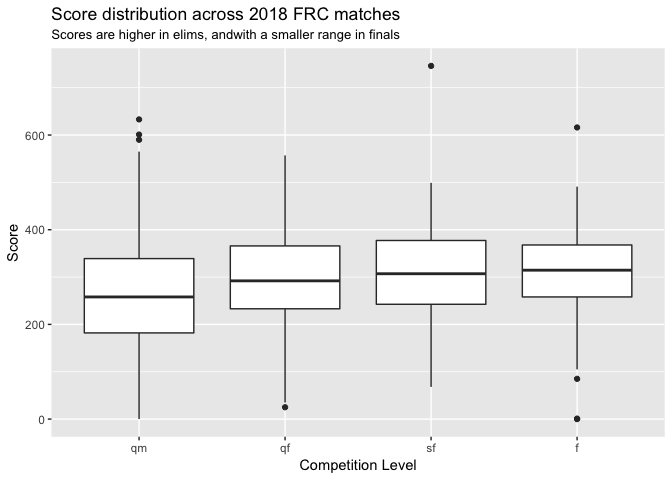
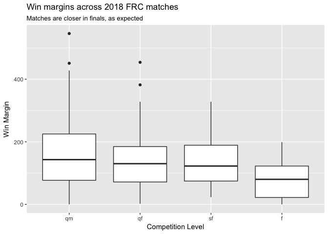
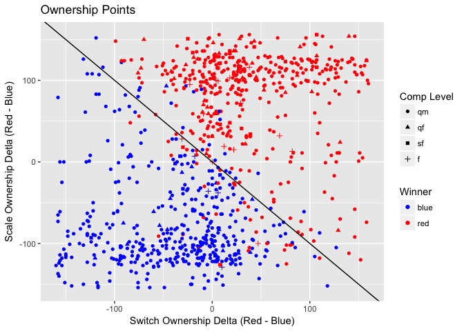
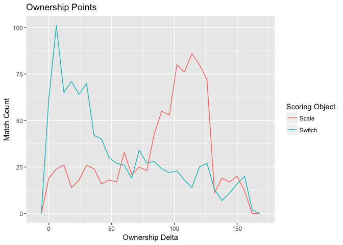
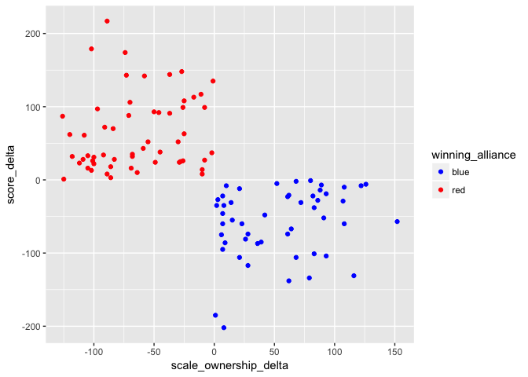

2018 FRC Match Analysis
================
Greg Marra

A notebook to get FRC Match data from The Blue Alliance API.

``` r
library(tidyverse)
```

    ## ── Attaching packages ───────────────────────────────────────────────────────────────────────────────────────────────────────────────── tidyverse 1.2.1 ──

    ## ✔ ggplot2 2.2.1     ✔ purrr   0.2.4
    ## ✔ tibble  1.4.2     ✔ dplyr   0.7.4
    ## ✔ tidyr   0.8.0     ✔ stringr 1.3.0
    ## ✔ readr   1.1.1     ✔ forcats 0.3.0

    ## ── Conflicts ──────────────────────────────────────────────────────────────────────────────────────────────────────────────────── tidyverse_conflicts() ──
    ## ✖ dplyr::filter() masks stats::filter()
    ## ✖ dplyr::lag()    masks stats::lag()

``` r
library(jsonlite)
```

    ## 
    ## Attaching package: 'jsonlite'

    ## The following object is masked from 'package:purrr':
    ## 
    ##     flatten

``` r
library(skimr)
```

    ## 
    ## Attaching package: 'skimr'

    ## The following objects are masked from 'package:dplyr':
    ## 
    ##     contains, ends_with, everything, matches, num_range, one_of,
    ##     starts_with

``` r
source("get_tba_data.R")
events <- getEvents("2018")

# Get Matches
matches <- events$event_code %>% 
  map(~ getEventMatches(2018, .x)) %>%
  bind_rows()

comp_levels <- c("qm", "qf", "sf", "f")
```

Distribution Of Match Scores
============================

The 2018 FRC game is somewhat unique, in that there is a maximum number of ownership points that can exist in a match, and teams need to tip the accumulation of those points towards their alliance. Early scoring is worth much more in that it can accumulate longer, while a box scored in a Switch or Scale during the last second of the match can only be worth a single point.

Here we look at the results from 1840 matches played so far this year.

``` r
matches %>%
  gather(alliances.red.score, alliances.blue.score, key = "alliance", value = "score") %>%
  filter(score >= 0) %>%
  ggplot(aes(parse_factor(comp_level, levels = comp_levels, ordered = TRUE), score)) +
  geom_boxplot() +
  labs(
    title = "Score distribution across 2018 FRC matches",
    subtitle = "Scores are higher in elims, andwith a smaller range in finals",
    x = "Competition Level",
    y = "Score"
  )
```



``` r
matches %>%
  filter(alliances.red.score >= 0) %>%
  filter(alliances.blue.score >= 0) %>%
  mutate(
    win_margin = abs(alliances.red.score - alliances.blue.score)
  ) %>%
  ggplot(aes(parse_factor(comp_level, levels = comp_levels, ordered = TRUE), win_margin)) +
  geom_boxplot() +
  labs(
    title = "Win margins across 2018 FRC matches",
    subtitle = "Matches are closer in finals, as expected",
    x = "Competition Level",
    y = "Win Margin"
  )
```



Ownership Deltas
----------------

How big are the swings between ownership?

``` r
matches_ownership <- matches %>%
  filter(alliances.red.score >= 0) %>%
  filter(alliances.blue.score >= 0) %>%
  filter(winning_alliance != "") %>%
  mutate(
    red_switch_ownership_pts = score_breakdown.red.autoSwitchOwnershipSec * 2 + score_breakdown.red.teleopSwitchOwnershipSec,
    blue_switch_ownership_pts = score_breakdown.blue.autoSwitchOwnershipSec * 2 + score_breakdown.blue.teleopSwitchOwnershipSec,
    red_scale_ownership_pts = score_breakdown.red.autoScaleOwnershipSec * 2 + score_breakdown.red.teleopScaleOwnershipSec,
    blue_scale_ownership_pts = score_breakdown.blue.autoScaleOwnershipSec * 2 + score_breakdown.blue.teleopScaleOwnershipSec,
    switch_ownership_delta = red_switch_ownership_pts - blue_switch_ownership_pts,
    scale_ownership_delta = red_scale_ownership_pts - blue_scale_ownership_pts,
    endgame_delta = score_breakdown.red.endgamePoints - score_breakdown.blue.endgamePoints,
    vault_delta = score_breakdown.red.vaultPoints - score_breakdown.blue.vaultPoints,
    foul_delta = score_breakdown.red.foulPoints - score_breakdown.blue.foulPoints,
    auto_delta = score_breakdown.red.autoPoints - score_breakdown.blue.autoPoints,
    score_delta = alliances.red.score - alliances.blue.score)

matches_ownership %>%
  ggplot(aes(switch_ownership_delta, 
             scale_ownership_delta, 
             color = winning_alliance,
             shape = parse_factor(comp_level, levels = comp_levels, ordered = TRUE)),
         alpha = 0.8) +
  geom_point() + 
  geom_abline(slope = -1) +
  labs(
    title = "Ownership Points",
    x = "Switch Ownership Delta (Red - Blue)",
    y = "Scale Ownership Detla (Red - Blue)",
    color = "Winner",
    shape = "Comp Level"
  ) + 
  scale_colour_manual(values = c(red = "red", blue = "blue"))
```



``` r
matches_ownership %>%
  gather(switch_ownership_delta, scale_ownership_delta, key = "ownership_object", value = "ownership_delta") %>%
  mutate(ownership_object = factor(ownership_object)) %>%
  mutate(ownership_object = fct_recode(ownership_object,
    "Switch" = "switch_ownership_delta",
    "Scale"  = "scale_ownership_delta"
  )) %>%
  ggplot(aes(abs(ownership_delta), color = ownership_object)) +
  geom_freqpoly(binwidth = 6) +
  labs(
    title = "Ownership Points",
    x = "Ownership Delta",
    y = "Match Count",
    color = "Scoring Object"
  )
```



Lose the Scale Win the Match
----------------------------

What explains matches where the team loses the Scale but still wins the Match?

We can look at the "scale deficit" a team had to overcome, and see what percentage of the scale deficit was overcome by deltas in other scoring objectives. We can normalize these deltas by the size of the Scale deficit that had to be overcome vs how large these deltas were. For example, if the Red Alliance Endgame scored more 60 points, and the Scale deficit they had to overcome was 45 points, their Endgame overcame 133% of the deficit.

Looking at the summary statistics for matches where Red lost the Scale but won the match, we can see that the median of the percent of the deficit overcome for the Endgame is about 67%, and the median for Switch ownership is about 122%, while the vault points are only 25%. It's hard to perfectly evaluate the vault points, because they also contribute to the powerups. I haven't totally vetted that I'm looking at the score breakdowns correctly here, so I'm not sure if this is all fully capturing everything. However, this suggests that if you're going to lose the Scale, you better win the Switch and nail your Endgame!

``` r
## Thought to explore here:
## In matches where the alliance loses the scale but manages to win, what fraction of the score_delta is explained by climb_delta, vault_delta, etc? What mechanic are teams using to lose the scale but win the match?

matches_ownership %>%
  filter(((scale_ownership_delta < 0) & (winning_alliance == "red")) |
        ((scale_ownership_delta > 0) & (winning_alliance == "blue"))) %>%
  ggplot(aes(scale_ownership_delta, score_delta, color = winning_alliance)) +
  geom_point() +
  scale_colour_manual(values = c(red = "red", blue = "blue"))
```



``` r
matches_ownership %>%
  filter(((scale_ownership_delta < 0) & (winning_alliance == "red")) |
         ((scale_ownership_delta > 0) & (winning_alliance == "blue"))) %>%
  filter(winning_alliance == "red") %>%
  filter(foul_delta < score_delta) %>% # remove matches won on fouls
  mutate(
    switch_ownership_delta_pct_margin = switch_ownership_delta / -scale_ownership_delta,
    endgame_delta_pct_margin = endgame_delta / -scale_ownership_delta,
    vault_delta_pct_margin = vault_delta / -scale_ownership_delta,
    foul_delta_pct_margin = foul_delta / -scale_ownership_delta,
    auto_delta_pct_margin = auto_delta / -scale_ownership_delta
  ) %>%
  select(contains("delta")) %>%
  skim()
```

    ## Skim summary statistics
    ##  n obs: 43 
    ##  n variables: 12 
    ## 
    ## Variable type: integer 
    ##       variable missing complete  n  mean    sd  p0  p25 median  p75 p100
    ##     auto_delta       0       43 43  8.7  11.65 -20  0        7 15.5   40
    ##  endgame_delta       0       43 43 31.05 26.18 -25 17.5     30 55     85
    ##     foul_delta       0       43 43  1.51 28.38 -75 -7.5      0 10     80
    ##    score_delta       0       43 43 68.16 45.59   8 26.5     61 99    174
    ##    vault_delta       0       43 43 15.7  12.98 -10 10       15 25     45
    ##      hist
    ##  ▁▂▃▇▃▃▁▁
    ##  ▂▂▂▇▂▅▅▁
    ##  ▁▁▂▇▆▂▁▁
    ##  ▇▃▃▂▅▁▃▁
    ##  ▃▃▇▇▇▇▂▂
    ## 
    ## Variable type: numeric 
    ##                           variable missing complete  n   mean    sd
    ##              auto_delta_pct_margin       0       43 43   0.15  0.97
    ##           endgame_delta_pct_margin       0       43 43   1.18  2.56
    ##              foul_delta_pct_margin       0       43 43   0.67  3.91
    ##              scale_ownership_delta       0       43 43 -57.35 36.39
    ##             switch_ownership_delta       0       43 43  71.93 48.68
    ##  switch_ownership_delta_pct_margin       0       43 43   4.15 17.64
    ##             vault_delta_pct_margin       0       43 43   0.49  1.75
    ##       p0     p25 median    p75  p100     hist
    ##    -5      0       0.16   0.29   2.5 ▁▁▁▁▁▇▁▁
    ##    -2.5    0.23    0.67   1.25  15   ▁▇▁▁▁▁▁▁
    ##    -1.88  -0.085   0      0.2   25   ▇▁▁▁▁▁▁▁
    ##  -126    -86.5   -55    -26.5   -1   ▃▅▃▅▅▃▇▅
    ##   -16     31      74    112.5  158   ▃▆▇▅▇▃▆▅
    ##    -8      0.72    1.22   2.32 116   ▇▁▁▁▁▁▁▁
    ##    -5      0.14    0.22   0.6   10   ▁▁▇▂▁▁▁▁
