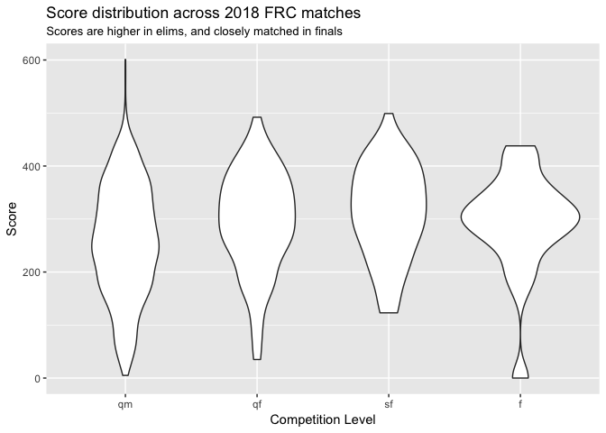
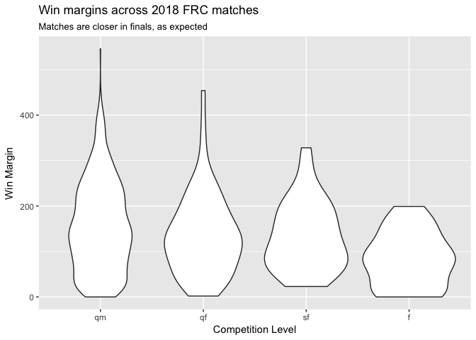

2018 FRC Match Analysis
================
Greg Marra

A notebook to get FRC Match data from The Blue Alliance API.

``` r
library(tidyverse)
```

    ## ── Attaching packages ──────────────────────────────────────────── tidyverse 1.2.1 ──

    ## ✔ ggplot2 2.2.1     ✔ purrr   0.2.4
    ## ✔ tibble  1.4.2     ✔ dplyr   0.7.4
    ## ✔ tidyr   0.8.0     ✔ stringr 1.3.0
    ## ✔ readr   1.1.1     ✔ forcats 0.3.0

    ## ── Conflicts ─────────────────────────────────────────────── tidyverse_conflicts() ──
    ## ✖ dplyr::filter() masks stats::filter()
    ## ✖ dplyr::lag()    masks stats::lag()

``` r
library(jsonlite)
```

    ## 
    ## Attaching package: 'jsonlite'

    ## The following object is masked from 'package:purrr':
    ## 
    ##     flatten

``` r
tba_auth_key <- fromJSON(read_file("tba_auth_key.json"))

# Get Events
url <- "https://www.thebluealliance.com/api/v3/events/2018"
req <- httr::GET(url, httr::add_headers("X-TBA-Auth-Key" = tba_auth_key$tba_auth_key))
json <- httr::content(req, as = "text")
events <- fromJSON(json)

# Get Matches
comp_levels <- c("qm", "qf", "sf", "f")

event_code_list <- events$event_code
output <- vector("list", length(event_code_list))
for (i in seq_along(event_code_list)) {
  url <- paste(c("https://www.thebluealliance.com/api/v3/event/2018",
                 event_code_list[[i]],
                 "/matches"),
               collapse = "")
  req <- httr::GET(url, httr::add_headers("X-TBA-Auth-Key" = tba_auth_key$tba_auth_key))
  json <- httr::content(req, as = "text")
  these_matches <- 0
  tryCatch(these_matches <- fromJSON(json))
  if(length(these_matches) > 0) {
    output[[i]] <- these_matches %>% flatten(recursive = TRUE)
  }
}

matches_flat <- bind_rows(output)
```

Distribution Of Match Scores
============================

The 2018 FRC game is somewhat unique, in that there is a maximum number of ownership points that can exist in a match, and teams need to tip the accumulation of those points towards their alliance. Early scoring is worth much more in that it can accumulate longer, while a box scored in a Switch or Scale during the last second of the match can only be worth a single point.

Here we look at the results from 1840 matches played so far this year.

``` r
matches_flat %>%
  gather(alliances.red.score, alliances.blue.score, key = "alliance", value = "score") %>%
  filter(score >= 0) %>%
  ggplot(aes(parse_factor(comp_level, levels = comp_levels, ordered = TRUE), score)) +
  geom_violin() +
  labs(
    title = "Score distribution across 2018 FRC matches",
    subtitle = "Scores are higher in elims, and closely matched in finals",
    x = "Competition Level",
    y = "Score"
  )
```



``` r
matches_flat %>%
  filter(alliances.red.score >= 0) %>%
  filter(alliances.blue.score >= 0)%>%
  mutate(
    win_margin = abs(alliances.red.score - alliances.blue.score)
  ) %>%
  ggplot(aes(parse_factor(comp_level, levels = comp_levels, ordered = TRUE), win_margin)) +
  geom_violin() +
  labs(
    title = "Win margins across 2018 FRC matches",
    subtitle = "Matches are closer in finals, as expected",
    x = "Competition Level",
    y = "Win Margin"
  )
```


