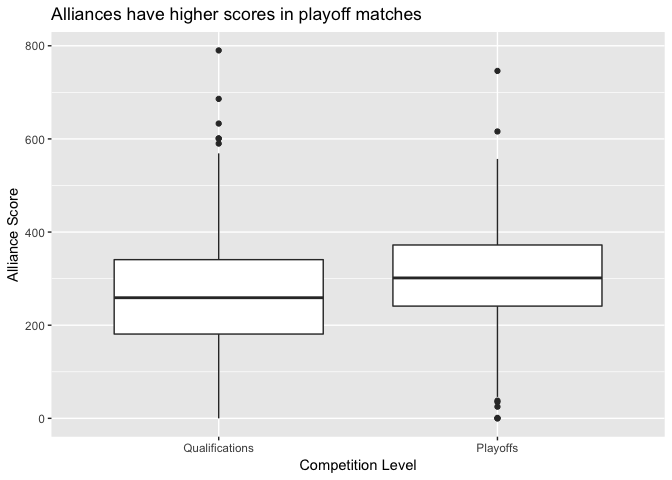
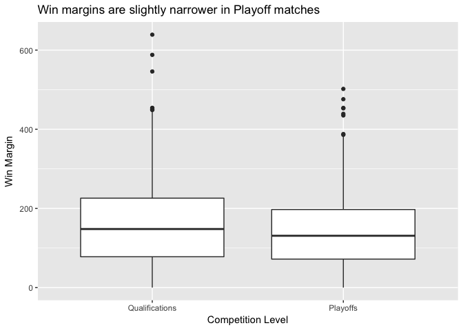
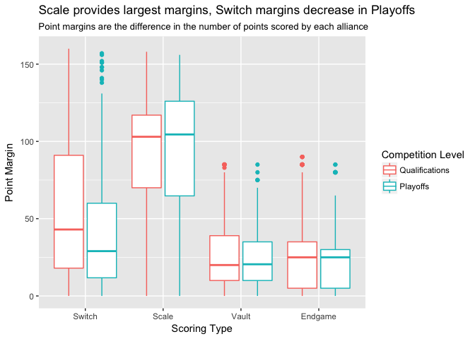
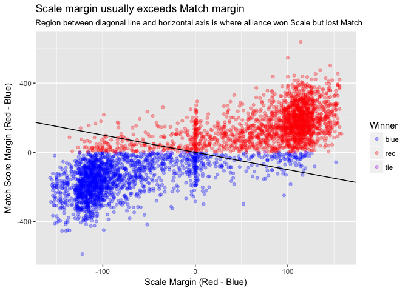
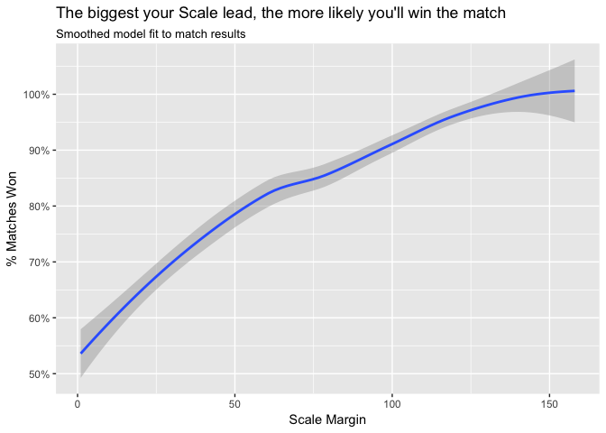
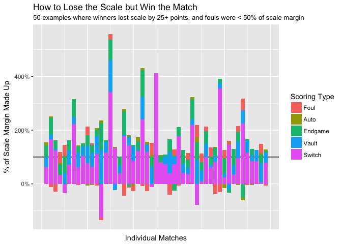
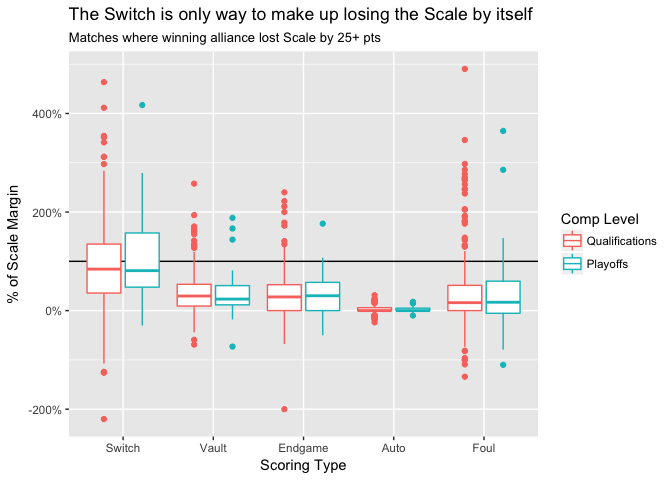

Week Two Match Analysis Using the TBA API and R
================
Greg Marra
3/10/2018

FIRST® POWER UP℠ is playing out to be a very interesting game! In this blog post, we'll use [The Blue Alliance API](https://www.thebluealliance.com/apidocs/) and the R programming language to analyze the 3821 matches played so far this year.

*The code for this blog post is available on my github at <https://github.com/gregmarra/frc-r>. Fork it, load it up in [RStudio](https://www.rstudio.com/), and try it out! If you want to learn more about using R to do data science, I recommend ("R for Data Science" by Hadley Wickham and Garrett Grolemund)(<http://r4ds.had.co.nz/>), which is available for free online.*

Box Plots
---------

In this blog post, I use box plots to visualize statistics of matches that have been played. A box plot shows the minimum, 25th percentile, median (or 50th percentile), 75th percentile, and maximum of the non-outlier values of a distribution, and shows the outliers as dots. If you aren't familiar with box plots, you can read more about them on Wikipedia: <https://en.wikipedia.org/wiki/Box_plot>

Match Results
-------------

Particularly in a game with complex strategy like FIRST® POWER UP℠, teams have to decide on the best way to score more points than their opposing alliance. Teams need to decide how to most efficiently spend every second of the match. Is it better to try to tip the Scale right now, deactive the opponent's Switch, or focus on the Vault?

One way to start to try to answer that question is to look at the score distribution among all matches, and the win margin of points between the winning alliance and the losing alliance. We can use box plots to easily visualize the results from all matches.

Looking at win margins, we see that the median win margin in qualification matches is 148 while the median win margin in playoff matches is only 148, 17 points lower!

How to Win
----------

What scoring objective is deciding how matches are won and lost?

In this analysis, I am lumping together ways of scoring points to group them with "what a robot focuses on doing": \* '''Auto''' - Points scored for crossing the line during the Autonomous period, excluding Scale and Switch ownership points \* '''Scale''' - Points scored from Scale ownership during the Autonomous and Teleoperated period, excluding points from the Boost powerup and ownership seconds from the Force powerup \* '''Switch''' - Points scored from Switch ownership during the Autonomous and Teleoperated period, excluding points from the Boost powerup and ownership seconds from the Force powerup \* '''Vault''' - Points scored for placing cubes in the Vault, scored by the Boost powerup, and ownership second points from the Force powerup, but not the Levitate powerup \* '''Endgame''' - Points scored for Endgame objectives, including by the Levitate powerup \* '''Foul''' - Points scored due to the other alliance's fouls

The Switch point margins are much smaller than the Scale point margins, both in Qualifications and Playoffs. In the typical match, the score margin created by the Switches isn't enough to overcome Scale scoring.

In 86.5% of Qualification matches and 88.5% of Playoff matches, the alliance that wins the Scale wins the match. This game is truly a battle for the Scale!

Below, we look at how your lead on the Scale affects the odds you'll win the match.

Lose the Scale, Win the Match
-----------------------------

Obviously it's good advice to try to outscore your opponent on the Scale, but if you're going to lose the Scale, how should you win the match?

If you're behind on the Scale, you've got to make up the points somewhere else. We can get a sense for what matters by looking at each other scoring objective's margin, and calculating it as the percent of the Scale margin the alliance had to overcome. If you lost the Scale by 50 points, but won the Switch by 25 points and won the Endgame by 30 points, we'd say the Switch made up 50% of the Scale margin, and the Endgame made up 60% of the Scale margin, so the alliance made up 110% of the Scale margin in total.

Here are some examples matches where an alliance lost the Scale by a margin of at least 25 points, but overcame that margin through other scoring objectives to win the match. I've removed matches where fouls were more than 50% of the made up margin, because it's a bad strategy to rely on your opponent giving you foul points!

This gets us a sense for example matches, but this visualization gets too crowded if we try to repeat this for all of the matches where the Scale loser won the match. Instead, we can look at the statistics of the "% of Scale made up" margins for the other scoring objectives.

Here it's clear that the Switch is the scoring objective that's making up most of the difference. In the median Scale comeback match, the Switch is accounting for 82.9% of the margin to make up, while the other scoring objectives' median percent margins made up are below 30%. This makes sense, as the other objectives have a smaller total point range available, and it is more likely the two alliance will perform similarly at those objectives.

### The Takeaway

If you're going to lose the Scale, make sure your Switch is always on and your opponent's Switch is always off, which will keep the total score margin between your alliances at 0. Then slightly outperform the opposing alliance at the Vault or Endgame, and you've got the match in the bag.

Further Analysis
----------------

We're only partway through Week 2 of FIRST® POWER UP℠, so there's plenty left to learn about this year's game. It will be interesting to repeat this analysis, and look at whether the winning strategies are evolving week to week. If you want to take this further, instructions for replicating my analysis are at the top of this post!

Go teams!
