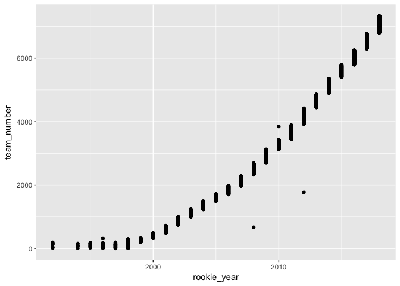
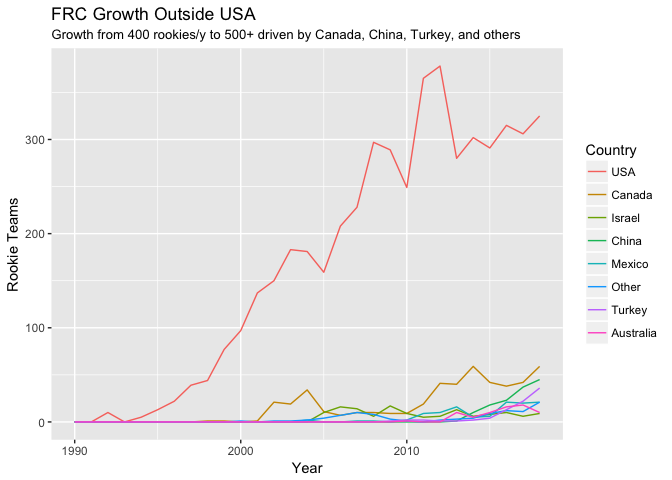

2018 Teams
================
Greg Marra

``` r
teams %>%
  filter(!is.na(rookie_year)) %>%
  ggplot(aes(rookie_year, team_number)) +
  geom_point()
```



``` r
teams %>%
  filter(!is.na(rookie_year)) %>%
  mutate(country = fct_lump(country, 7)) %>%
  mutate(country = country %>% fct_infreq()) %>%
  ggplot(aes(rookie_year, color = country)) +
  geom_freqpoly(binwidth = 1) +
  xlim(1990, 2018) +
  labs(
    title = "FRC Growth Outside USA",
    subtitle = "Growth from 400 rookies/y to 500+ driven by Canada, China, Turkey, and others",
    x = "Year",
    y = "Rookie Teams",
    color = "Country"
  )
```

    ## Warning: Removed 16 rows containing missing values (geom_path).


